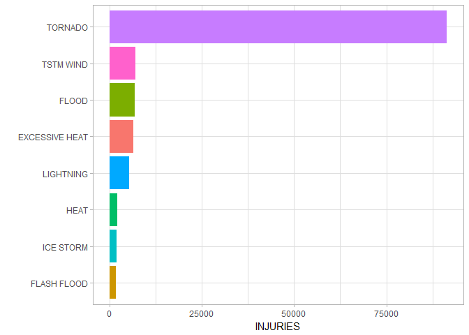

## Which types of events are most harmful to population health?
Fatalities and injuries have the most impact on public health, so I will present what types of severe weather are the most dangerous.
The first plot presents a Death toll by Event type

```
StormData %>%
      select(FATALITIES, EVTYPE) %>%
      group_by(EVTYPE) %>%
      summarise(SumFATALITIES = sum(FATALITIES)) %>%
      top_n(n = 8, wt = SumFATALITIES) %>%
      ggplot(aes(y = SumFATALITIES, x = reorder(x = EVTYPE, X = SumFATALITIES), fill=EVTYPE))+
      geom_bar(stat = "identity", show.legend = FALSE) +
      #geom_text(aes(label=SumFATALITIES), size = 4, hjust = 0.5, vjust = -0.1) +
      xlab(label = "") +
      ylab(label = "Death toll") +
      coord_flip() +
      theme_light()
      
```


The second plot presents Injuries by Event type

```
StormData %>%
      select(INJURIES, EVTYPE) %>%
      group_by(EVTYPE) %>%
      summarise(SumINJURIES = sum(INJURIES)) %>%
      top_n(n = 8, wt = SumINJURIES) %>%
      ggplot(aes(y = SumINJURIES, x = reorder(x = EVTYPE, X = SumINJURIES), fill=EVTYPE))+
      geom_bar(stat = "identity", show.legend = FALSE) +
      #geom_text(aes(label=SumINJURIES), size = 4, hjust = 0.5, vjust = -0.1) +
      xlab(label = "") +
      ylab(label = "INJURIES") +
      coord_flip() +
      theme_light()
```


## Which types of events have the greatest economic consequences?

This plot shows Property damage estimates by Event type

```
StormData %>%
      select(PROPDMG, PROPDMGEXP2, EVTYPE) %>%
      group_by(EVTYPE) %>%
      mutate(SumPROPDMGEXP = (PROPDMG * PROPDMGEXP2)) %>%
      summarise(SumPROPDMGEXP2 = sum(SumPROPDMGEXP)) %>%
      top_n(n = 8, wt = SumPROPDMGEXP2) %>%
      ggplot(aes(y = SumPROPDMGEXP2, x = reorder(x = EVTYPE, X = SumPROPDMGEXP2), fill=EVTYPE))+
      geom_bar(stat = "identity", show.legend = FALSE) +
      #geom_text(aes(label=SumFATALITIES), size = 4, hjust = 0.5, vjust = -0.1) +
      xlab(label = "") +
      ylab(label = "Property damage estimates") +
      coord_flip() +
      theme_light()
```


## Conclusion
As you can see above flood has the greatest economic consequences. Tornado is the most harmful to population health because caused the most death tolls and injuries.
